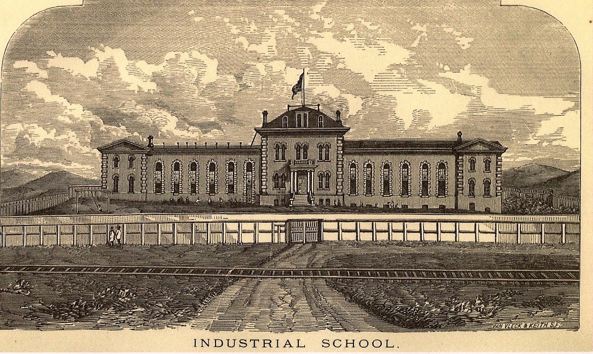
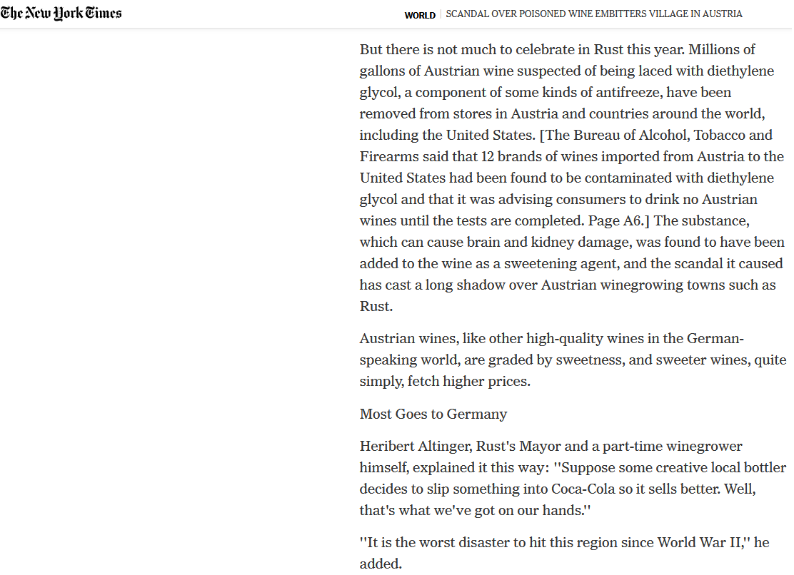
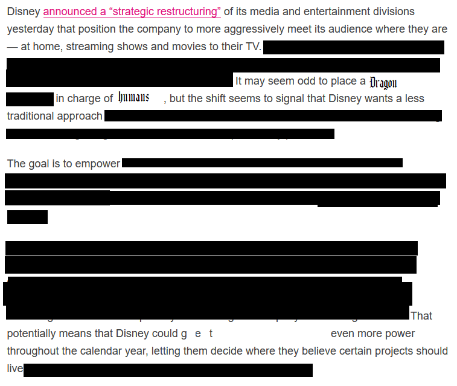

<html>
   <!--ENGLISH FINAL-->
    <head>
        <meta charset="utf=8">
        <title>THE DRAGON</title>
        <meta name="THE DRAGON">
        <link href="helmswald-post.otf">
        
   </head>

    <body>
        

        <b1>
            DRAGONS.
             
            MAN MADE MONSTERS
        </b1>
    

    <b4>
        

            

                
            

        

        In the depths of dispair they brought the promise of hope.
         
        In exchange for giving up your children they offered wealth 
        

            
        

         
        In exchange for your gold they offered happiness forged from pyrite
        

            
            

        The deals they have made with man have been obfuscated by the dark miasma constantly spewing from their maws,
         
        as they are an artificial organism that cares not who dies, as long as their greed is perpetually satiated.
        

            
            

         
        They have woven their dark tendrils deep into the fabric of all that is, and watch with gluttonous eyes our every move.
         
            

            
            

         
        Their goals are simple
          
        to consume your soul
           bit by bit
           until they are full.
         
        But the beasts have no stomach
           their appetite can never truly be satiated.
         
        Thus each day they grow more cruel
           finding new ways to lodge themselves into the hearts of men so they may take another bite.
        

            
            

         
        They are more than Religion
         
          
        They are more than Evil
         
          
        They are more than Rulers
         
          
        They are more than Devils
         
          
        They are Dragons
          
         
        God save us
         
         
        <a href="credits.html" target="_blank"> Credits</a>
        </b4>
    </body>
</html>
